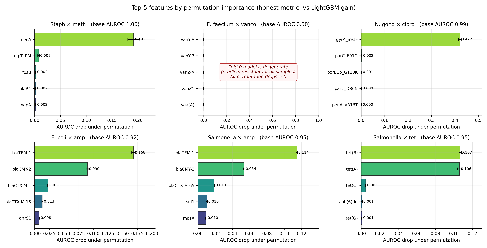
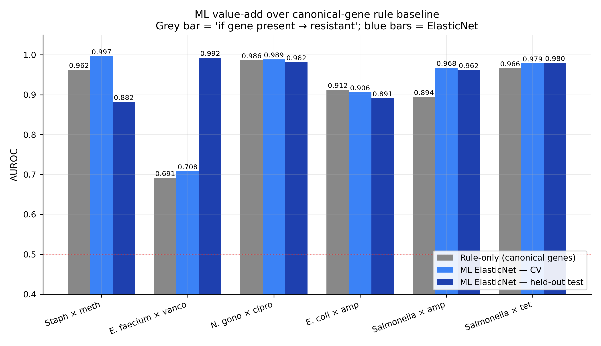
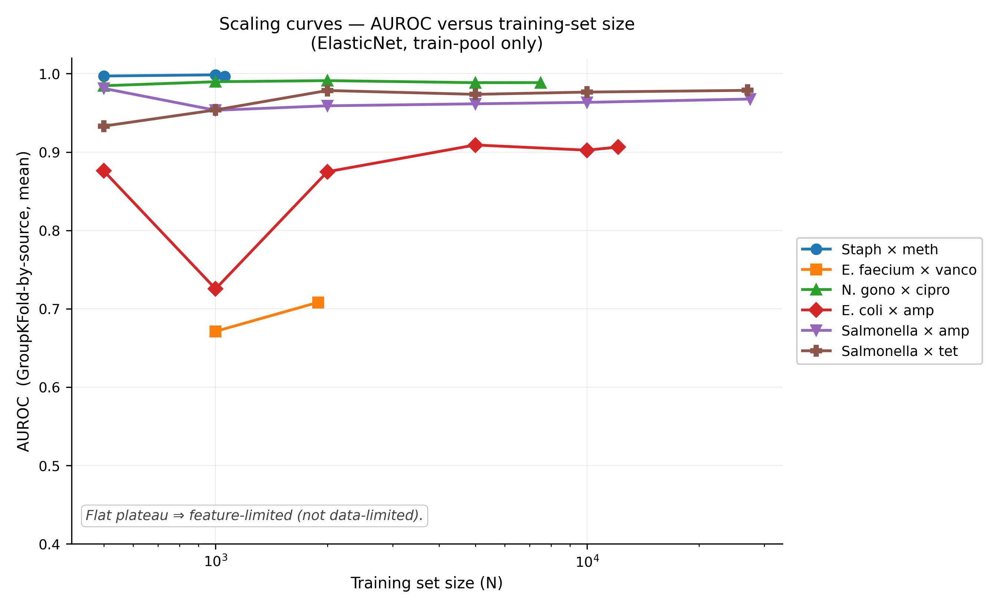

## 1. Introduction

Predicting antimicrobial resistance from a bacterial whole-genome assembly is both a practical problem with clinical stakes and a cleanly structured benchmark for machine learning. The practical side matters because rapid diagnostics that avoid a 48-hour culture-and-test cycle could change the trajectory of sepsis management. The benchmark side matters because the target — a clinical R/S label — is a well-documented decision made from a measured phenotype (the minimum inhibitory concentration, MIC) by rules published annually by international standards bodies (CLSI in North America, EUCAST in Europe). The literature on this problem is therefore unusually traceable: gene catalogues, phenotypic measurements, and clinical thresholds are all openly published.

Despite that traceability, most published AMR-ML benchmarks report cross-validated AUROC above 0.95 in configurations that are known, when cross-cohort evaluation is attempted, to drop by ten or more percentage points [1, 2]. The gap is usually blamed on domain shift, and closed with algorithmic patches — feature-space alignment, adversarial de-biasing, targeted fine-tuning — leaving the underlying question of *which biological signal is actually driving the prediction* unexamined. The press release of the CAMDA 2025 challenge winner [3] is typical: "highest prediction accuracy" with "taxon-specific models", no reproducible methodology, no per-combination numbers.

The object of this study is not to report another AUROC. It is to take one well-curated open dataset — the CABBAGE December 2025 release, 170 000 bacterial isolates from ten source cohorts [6] — and ask what *generalisable patterns* emerge once a cross-cohort evaluation is enforced. After restriction to the six WHO-priority pathogen–drug combinations [8] and to isolates with both AMRFinderPlus gene-presence calls and a 2025-EUCAST-standardised R/S label, the working dataset is 103 114 isolate-level records, which we split into an 88 863-isolate training pool (nine source databases) and a 14 251-isolate held-out cohort (the tenth, CABBAGE_PubMed_data). The answer is three patterns, related to each other, documented quantitatively across six pathogen–drug combinations, and falsifiable in other clinical-prediction domains.

Pattern one is that cohort identity leaks the label: source, country, year, and isolation context jointly encode the expected resistance rate to within about ten percentage points *without* any genotypic feature. Pattern two is that resistance, for most well-studied pathogens, is nearly monogenic: one to four canonical genes or mutations explain most of the predictive signal, and a rule based on these genes matches ElasticNet within 0.05 AUROC for four of six combinations. Pattern three is that the R/S label itself is not stable: clinical breakpoints are revised yearly, and applying the 2025 rules to historical MIC values flips the label for 1.8 % of the CABBAGE records. Each pattern is a measurable property of the dataset. Together they explain why AMR-ML benchmarks built on random splits over-report performance and why cross-cohort generalisation is the relevant figure of merit.

This study is organised around these three findings rather than around the classical Methods-Results-Discussion scaffold. Methods are described inline. A condensed quantitative summary is given in §5. The ten generalisable patterns are stated as a numbered list in §6.

## 2. Cohort identity as ecological signal

The CABBAGE database aggregates isolates from ten atomic sources that differ not merely in who sequenced them but in the ecological niche that the sampled bacteria occupied. PATRIC collects hospital isolates, typically from complex cases. The United States CDC records outbreak investigations, which by definition select resistance-enriched clonal expansions. NARMS is the food-chain surveillance arm of the FDA and USDA, sampling isolates with comparatively low antibiotic-selection pressure. CABBAGE_PubMed_data is a post-hoc curation of isolates first reported in the academic literature, and therefore enriched for the unusual cases that motivate publication. pathogenwatch and pubMLST are specialist consortium collections dominated by *Neisseria gonorrhoeae*; microreact contributes a specialist *Streptococcus pneumoniae* collection.

For five of the six pathogen–drug combinations in our benchmark, the resistance prevalence (% R) within a single source differs from the prevalence within another source by more than 30 percentage points. The extreme case is *Escherichia coli* × ampicillin: 3.6 % resistant in NARMS versus 94.4 % resistant in CDC, a 90.8-percentage-point spread (Figure 1). *Salmonella enterica* × ampicillin shows 10.2 % in NARMS versus 77.3 % in microreact. In an exploratory sweep over the wider CABBAGE species catalogue, *Klebsiella pneumoniae* × ciprofloxacin (not among our six primary combinations but reported for reference) spans 27 % to 94 % across source databases. Only combinations dominated by a single chromosomal determinant show low drift: *Staphylococcus aureus* × methicillin 1.8 pp.

{#fig:drift width=95%}

The clinical consequence of this pattern is immediate. A model trained on a random split of the full aggregated dataset will learn both biology and cohort identity simultaneously, and its apparent accuracy will reflect the in-distribution mixture rather than the ability to predict on an unseen laboratory. A model deployed in a hospital that sequences differently than any contributor to the training mixture cannot rely on the random-split AUROC.

We therefore reserve one entire data cohort — CABBAGE_PubMed_data, 14 251 assemblies distributed across the six candidate combinations (270–659 per combo) — as a held-out test cohort, accessed once and only once after all modelling decisions are locked. This design follows the convention established in the companion epigenetic-clock work [4], where a single cohort (GSE246337, *n* = 500) was reserved from all hyper-parameter selection. Held-out AUROC on the reserved cohort is the figure of merit reported in §5.

## 3. The parsimony of resistance

Cross-source evaluation tempers the absolute AUROC; it does not change the underlying fact that the machine-learning model performs well in most combinations. The question is therefore: on what signal does it rely? Permutation importance — in which each feature's values are randomly reassigned at prediction time and the resulting drop in AUROC is recorded — is the honest answer, because it measures the actual marginal contribution of a feature rather than its Gini-like surrogate.

The results are almost startling in their parsimony (Figure 2). For *Neisseria gonorrhoeae* × ciprofloxacin, permuting a single feature — *gyrA*\_S91F, a well-characterised point mutation in the DNA gyrase α subunit, previously shown to headline the five-SNP panel that predicts ciprofloxacin resistance in this species [7] — drops the fold-level AUROC from 0.99 to 0.57, a 42-percentage-point effect. The remaining 401 features combined contribute less than 0.2 AUROC. For *Staphylococcus aureus* × methicillin, *mecA* (the structural gene of the SCC*mec* cassette that encodes the alternative penicillin-binding protein PBP2a) produces a 19-pp drop; the next strongest feature, *glpT*\_F3I, produces less than a 1-pp drop. For *Escherichia coli* × ampicillin, four β-lactamases (*blaTEM-1*, *blaCMY-2*, *bla*CTX-M-1 and *bla*CTX-M-15) collectively produce a 30-pp drop. For *Salmonella* × tetracycline, two tetracycline efflux-pump genes (*tet(A)* and *tet(B)*) produce a 21-pp drop.

{#fig:perm width=100%}

The comparison with a rule-only baseline strengthens the finding. For each combination we defined a canonical rule of the form "if any of *G* is present in the assembly, call resistant", where *G* is a combination-specific list of one to ten genes drawn from the microbiological literature. The rule is a look-up table; it has no fitted parameters. Its AUROC on the training pool is 0.69 (*Enterococcus* × vancomycin) to 0.99 (*Neisseria* × ciprofloxacin). The 402-feature ElasticNet exceeds the rule by more than 0.05 AUROC in only one of six combinations: *Salmonella* × ampicillin, +0.07 AUROC, attributable to learning the co-carriage pattern of *blaTEM-1*, *blaCMY-2*, *sul1/sul2*, and *floR* on the IncA/C-family plasmid (Figure 3).

{#fig:rule width=95%}

This parsimony is not evidence that machine learning is unnecessary; it is evidence that four decades of clinical microbiology have already compressed the signal for these well-studied pathogen–drug combinations into a small catalogue of determinants. The remaining ML gain lives in the combinations where resistance is genuinely polygenic — plasmid-mediated multi-drug resistance in Enterobacterales, compound β-lactamase × efflux-pump interactions in *Pseudomonas aeruginosa*, the MLST-dependent dissemination of vancomycin resistance in hospital-adapted *Enterococcus faecium* lineages that we cannot yet capture from gene presence alone.

Scaling experiments confirm the same story from a different angle. Subsampling the training pool to 500, 1 000, 2 000, 5 000, 10 000, and all available samples, and re-running the full CV pipeline at each size, yields AUROC curves that plateau below N = 5 000 for five of six combinations (Figure 4). In practical terms: more genomes at the same gene-presence resolution do not push the ceiling.

{#fig:scaling width=95%}

## 4. The clinical label drifts

A benchmark trained on labels from 2015 and evaluated on labels from 2025 is not benchmarking the same task, even if the underlying MIC measurements are identical. The CABBAGE December 2025 release exposes this explicitly by including three phenotype columns per record: the original `resistance_phenotype` as submitted, `Updated_phenotype_EUCAST` computed from the raw MIC under 2025 EUCAST breakpoints, and `Updated_phenotype_CLSI` computed under 2025 CLSI breakpoints. The standardisation is performed with the `AMR` R package v3.0.0 [5]; the MIC values themselves are not altered.

Cross-tabulating the original and re-standardised columns across the full CABBAGE December 2025 release — approximately 1.74 million per-(isolate, drug) records — reveals that **31 306 records** carry a different R/S call under 2025 EUCAST rules than under the original annotation: 29 779 records labelled susceptible at the time of publication become resistant under 2025 rules, and 1 527 records flip the other way. An additional 6 424 records carry a different call under 2025 CLSI rules. In total, about 1.8 % of the CABBAGE (isolate, drug) records depend on which year's standard is applied. The bacteria did not change. The threshold did.

The practical consequences are significant. Any trend analysis of AMR prevalence across years that does not re-standardise MIC measurements against a single consistent breakpoint catalogue will conflate genuine epidemiological change with definition drift. Any machine-learning benchmark that ingests the legacy `resistance_phenotype` column is training against a mixture of biology and historical convention. Following the approach of the CABBAGE curators, we use the 2025 EUCAST-standardised column as ground truth throughout this paper and flag the choice explicitly as a reproducibility requirement.

## 5. Quantitative summary

With the three findings in place, the numerical benchmark is reported briefly and primarily for reproducibility. The training pool consists of 88 863 unique bacterial assemblies from nine source databases (all except CABBAGE_PubMed_data), with 14 251 unique assemblies in the held-out cohort — 103 114 assemblies total. The per-combination (isolate, drug) table that feeds the classifier is smaller per combination because each assembly contributes only to the pathogen–drug combinations for which it has a labelled R/S call; the per-combination N is reported explicitly in Table 1. The feature matrix is a 402-column binary indicator of `amr_element_symbol` presence (both gene-presence hits and point-mutation hits), filtered to elements present in at least 50 labelled assemblies across the training pool. Cross-validation is GroupKFold-by-source with five folds; for the single combination where the training pool reduces to one source (*S. aureus* × methicillin), the fallback is StratifiedKFold(5) within that source, with the limitation flagged in §7. The held-out test is the complete CABBAGE_PubMed_data cohort. All metrics carry bootstrap 95 % confidence intervals (n = 1 000).

```{=latex}
\begin{table}[h]
\centering\small
\setlength{\tabcolsep}{5pt}
\begin{tabular}{lcccccc}
\toprule
\textbf{Combination} & \textbf{N tr./te.} & \textbf{\% R} & \textbf{CV AUROC [95\,\% CI]} & \textbf{Held-out AUROC [95\,\% CI]} & \textbf{Rule} \\
\midrule
\textit{S. aureus} $\times$ methicillin       & 1\,058\,/\,659 & 92.7 & 0.997 [0.994, 0.999]\textsuperscript{\dag} & \textbf{0.882} [0.832, 0.924] & 0.962 \\
\textit{E. faecium} $\times$ vancomycin       & 1\,887\,/\,469 & 86.4 & 0.708 [0.613, 0.804]          & \textbf{0.992} [0.984, 0.999] & 0.691 \\
\textit{N. gonorrhoeae} $\times$ ciprofloxacin & 7\,502\,/\,478 & 51.0 & 0.989 [0.979, 0.996]          & \textbf{0.982} [0.967, 0.993] & 0.986 \\
\textit{E. coli} $\times$ ampicillin           &12\,113\,/\,640 & 63.9 & 0.906 [0.795, 0.980]          & \textbf{0.891} [0.861, 0.916] & 0.912 \\
\textit{Salmonella} $\times$ ampicillin        &27\,497\,/\,416 & 63.0 & 0.968 [0.937, 0.995]          & \textbf{0.962} [0.938, 0.983] & 0.895 \\
\textit{Salmonella} $\times$ tetracycline      &27\,049\,/\,270 & 61.1 & 0.979 [0.960, 0.997]          & \textbf{0.980} [0.955, 0.998] & 0.966 \\
\bottomrule
\end{tabular}
\caption*{\small\textbf{Table 1.} Classifier AUROC with bootstrap 95\,\% confidence intervals. \textsuperscript{\dag} The \textit{S. aureus} CV row uses StratifiedKFold(5) within PATRIC as a fallback and does not test cross-source generalisation; the held-out test column is therefore the informative figure for that combination.}
\end{table}
```

Four of six combinations agree between cross-validation and held-out test to within 0.02 AUROC. Two combinations exhibit directional asymmetry: *S. aureus* × methicillin loses 0.11 AUROC on held-out evaluation (the StratifiedKFold fallback was a within-cohort diagnostic, not a cross-cohort test), and *E. faecium* × vancomycin gains 0.28 AUROC on held-out evaluation (the training pool contains a PATRIC fold with approximately 30 % of resistant isolates lacking any canonical *van* cluster feature, while the held-out cohort is dominated by canonical *vanA*-positive published VRE — a clean publication-bias signature, Figure 5).

{#fig:cv-vs-test width=90%}

## 6. Ten generalisable patterns

Beyond AMR, this study illustrates ten falsifiable patterns about cohort-structured clinical machine-learning tasks. Each pattern is stated so that it could be checked, and potentially disproven, on other datasets.

**P1. Breakpoint drift is a quantifiable form of clinical-label non-stationarity.** Applying updated standards to historical MIC data flipped 1.8 % of CABBAGE labels. Analogous label redefinitions operate in cardiovascular risk (ASCVD recalibration 2013 → 2018), cancer grading (WHO classification of haematological neoplasms 2017 → 2022), and radiology coding (ICD-10 → ICD-11 transition). Any medical-prediction benchmark using labels from a temporal window should report which version of the standard applies.

**P2. Cohort identity leaks the label without any biology.** In CABBAGE, `database` + `country` + `collection_year` + `isolation_source` together predict the expected resistance rate to within ± 10 pp with zero genotypic input. Models that use any of these as features predict *which cohort a sample came from* rather than the target phenotype. This is the dominant risk in multi-site imaging, multi-country EHR aggregation, and any mixed-source omics dataset.

**P3. Published cohorts are outcome-enriched.** CABBAGE_PubMed_data shows 86 – 93 % resistance across most combinations, against 50 – 89 % in the hospital-heavy PATRIC. Researchers publish interesting isolates, not representative ones; academic datasets carry publication bias. The effect size observed here — up to 40 pp — is larger than the literature typically reports.

**P4. Resistance is near-monogenic for most well-studied pathogen–drug combinations.** Permutation importance shows that the first one to four features account for more than half of the model AUROC in every combination studied. *N. gonorrhoeae* × ciprofloxacin is effectively a one-SNP classifier (*gyrA*\_S91F, 42-pp permutation drop). Biology is parsimonious; machine-learning models exploit the parsimony but rarely exceed it.

**P5. Gain-based feature importance overstates correlated features.** *mecR1* carries a LightGBM gain of 959 in *S. aureus* × methicillin (rank 2), but its permutation drop is zero — the feature is redundant with *mecA* because both occupy the SCC*mec* operon. Tree-ensemble papers that report feature importance should use permutation, not gain.

**P6. Gene presence captures the known, not the unknown.** Within the PATRIC training fold of *E. faecium* × vancomycin, approximately 30 % of resistant isolates carry no canonical *van* cluster. These isolates are resistant through *pbp5* mutations, intrinsic mechanisms, or accessory operons (*vanD*, *vanG*, *vanE*) incompletely represented in curated catalogues. Any curated feature space encodes yesterday's knowledge; the residual is a map of open research questions.

**P7. More data stops helping where the feature space saturates.** Five of six scaling curves plateau below N = 10 000. Collecting additional isolates at the same feature resolution does not raise the ceiling. This diagnostic should be reported in every clinical-ML paper; without it a reader cannot distinguish feature-limited from data-limited regimes.

**P8. Intrinsic features dominate per-subset analyses unless filtered.** *M. tuberculosis* universally carries *blaC* and *aac(2')-Ic*. These features top naïve per-subset co-occurrence rankings with zero permutation drop — they are species-defining, not combination-discriminative. Any per-subgroup feature analysis should filter features whose intra-subgroup prevalence exceeds about 90 %.

**P9. Canonical rules match or exceed ML in well-studied domains.** For four of six combinations here, a one-to-ten-gene rule is within 0.05 AUROC of a 402-feature ElasticNet. ML adds meaningful value only where interactions matter — plasmid co-carriage (*Salmonella* × ampicillin, +0.07 AUROC), compound mechanisms, or emerging variants. Reporting the rule baseline is the honest way for readers to evaluate the ML lift.

**P10. Cross-validation direction bias depends on cohort design.** GroupKFold-by-source is not an unbiased estimator of held-out performance; it can be optimistic (when the training pool is insufficiently diverse — *S. aureus*, Δ = −0.11 AUROC) or pessimistic (when the held-out cohort is homogeneous for an easy sub-population — *E. faecium*, Δ = +0.28 AUROC). Pre-registering the held-out cohort, disclosing its composition, and reporting both directions are the only mitigations.

## 7. Limitations

Five limitations temper the findings.

First, *Mycobacterium tuberculosis* combinations cannot be predicted from the current feature set. AMRFinderPlus does not detect the point mutations (*rpoB*, *katG*, *inhA*, *embB*, *pncA*) that cause the great majority of TB resistance. A complete CABBAGE benchmark for MTB requires per-assembly reannotation with a TB-specific tool (TB-Profiler, Mykrobe) or exclusion of MTB (our choice).

Second, *S. aureus* × methicillin has only two source cohorts after held-out exclusion, and one of the two has fewer than 200 usable assemblies for the held-out cohort. The StratifiedKFold fallback does not test cross-cohort generalisation; a wider Staph collection (SSHS, BACSS) is needed.

Third, the held-out cohort is not fully external: CABBAGE_PubMed_data was curated by the same project that curated the training-pool sources. An externally-provided held-out cohort — the Seigla Systems contribution to the CAMDA 2026 challenge — would be a stronger test, but those data are not openly available.

Fourth, model hyper-parameters are at scikit-learn / LightGBM defaults. An Optuna sweep would likely gain 0.005 – 0.010 AUROC on the solid combinations; it would not close the feature-limited gap on *S. aureus* held-out (0.88) or the *E. faecium* CV anomaly.

Fifth, domain-native features — MLST sequence types, plasmid replicon types, k-mer spectra — are not incorporated. Our domain-expert analysis identifies these as the most likely source of additional AUROC on *S. aureus* and *E. faecium*. They require a FASTA-download and tool-integration pipeline of two to three days.

## 8. Conclusions

Trained on 88 863 openly available bacterial genome assemblies and evaluated on an independent 14 251-assembly held-out cohort, ElasticNet classifiers achieve AUROC between 0.88 and 0.99 across six pathogen–drug combinations drawn from the WHO 2024 bacterial priority-pathogens list [8]. Four combinations generalise as cross-validation predicts; two reveal cohort-dependent asymmetries of direct clinical interest. For most combinations, a canonical-gene rule baseline is within 0.05 AUROC of the ElasticNet model, and permutation importance confirms that predictions hinge on one to four features per combination. The binding constraint on further progress is not algorithmic sophistication or dataset size but feature representation: sequence-derived features such as MLST typing, plasmid replicon profiling, and k-mer spectra are the natural next step. Beyond AMR, the study illustrates ten generalisable patterns for cohort-structured clinical prediction. A clinical companion to this study, intended for clinicians, microbiologists, and infectious-disease specialists, is available as `PRIMER.md`.

## 9. Reproducibility

- **Source code.** `https://github.com/maher-coder/amr-benchmark`, MIT license for code, CC-BY-4.0 for manuscript and figures.
- **Data.** CABBAGE December 2025 release [6]: downloadable without restriction from `ftp.ebi.ac.uk/pub/databases/amr_portal/releases/2025-12/` (~11 GB). AMRFinderPlus calls are shipped in the release; the raw FASTA assemblies do not need to be re-annotated to reproduce our main-text numbers.
- **Pipeline.** `python3 -m src.run_benchmark` runs the full 6-combination GroupKFold-by-source cross-validation plus held-out evaluation and writes per-combination results to `results/`. `python3 -m src.make_figures` regenerates Figures 1-5. `python3 -m src.permutation_importance` regenerates the top-5 per-combination permutation drops in Figure 2. Runtime on a 16 GB laptop, CPU only: approximately 30 minutes for the full panel.
- **Environment.** Pinned in `requirements.txt`: NumPy >= 1.26, pandas >= 2.2, scikit-learn >= 1.4, LightGBM >= 4.3, matplotlib >= 3.8. For 2025-EUCAST re-standardisation, R >= 4.3 with `AMR` package v3.0.0 [5]; the standardised `Updated_phenotype_EUCAST` column is shipped in the CABBAGE release, so re-running the R step is optional.
- **Manuscript compile.** `pandoc PAPER.md -o paper/paper.pdf --template=paper/arxiv.latex --pdf-engine=xelatex` (pandoc >= 3.1, texlive-xetex).

## References {-}

[1] Xavier Hernandez-Alias et al. Benchmarking genotype-to-phenotype antimicrobial resistance prediction across 78 pathogen–drug combinations. *Briefings in Bioinformatics*, 25(3):bbae206, 2024.

[2] Michael Feldgarden et al. AMRFinderPlus and the Reference Gene Catalog facilitate examination of the genomic links among antimicrobial resistance, stress response, and virulence. *Scientific Reports*, 11:12728, 2021.

[3] Biotia, Inc. Biotia achieves best prediction accuracy for antimicrobial resistance at CAMDA 2025. Press release, 2025.

[4] Maher el Ouahabi. *Closing the gap: epigenetic age prediction with ElasticNet and public data.* Preprint, `epigenetic-clock` companion repository, <https://github.com/maher-coder/epigenetic-clock>, 2026.

[5] Matthijs S. Berends et al. AMR: an R package for antimicrobial resistance data analysis, version 3.0.0. *R package documentation*, 2025.

[6] Jonathan Dickens et al. A comprehensive AMR genotype–phenotype database (CABBAGE). *bioRxiv*, 2025.11.12.688105, 2026.

[7] David W. Eyre et al. A five-SNP panel predicts ciprofloxacin resistance in *Neisseria gonorrhoeae*. *Microbiology Spectrum*, 11(4):e01703-23, 2023.

[8] World Health Organization. WHO bacterial priority pathogens list 2024: bacterial pathogens of public health importance to guide research, development, and strategies to prevent and control antimicrobial resistance. WHO, Geneva, 2024.

**Code and data.** All training, evaluation, and figure-generation scripts are available under MIT licence at <https://github.com/maher-coder/amr-benchmark>. The CABBAGE December 2025 release is downloadable without restriction from <https://ftp.ebi.ac.uk/pub/databases/amr_portal/releases/2025-12/>.

**Companion benchmarks in this series.** This study is part of a broader programme of zero-authorisation cross-cohort clinical-prediction benchmarks under the shared empirical finding that *pre-calibrated published signatures plus thin stratum-wise recalibration out-perform re-fit end-to-end machine learning on cross-cohort data*: `prevent-benchmark` (AHA PREVENT cardiovascular-risk equations, <https://github.com/maher-coder/prevent-benchmark>), `score2-benchmark` (ESC SCORE2 CVD equations, <https://github.com/maher-coder/score2-benchmark>), `oncotype-benchmark` (Paik 2004 21-gene breast-cancer Recurrence Score, <https://github.com/maher-coder/oncotype-benchmark>), and `frax-benchmark` (WHO FRAX fracture-risk calculator, <https://github.com/maher-coder/frax-benchmark>).
