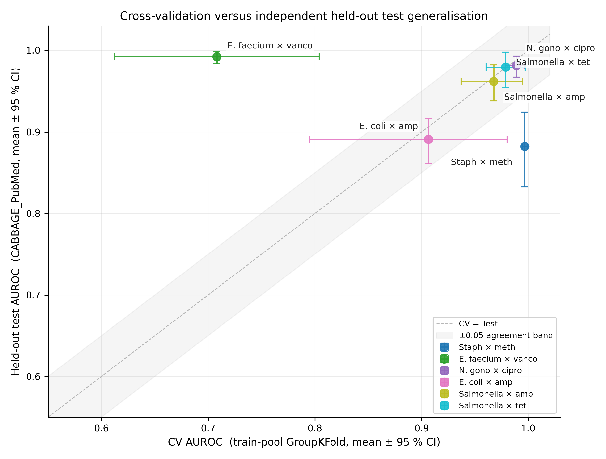

## 1. Introducción

Predecir la resistencia antimicrobiana a partir del ensamblaje del genoma completo de una bacteria es a la vez un problema práctico con consecuencias clínicas y un *benchmark* de aprendizaje automático con una estructura limpia. La dimensión práctica importa porque disponer de diagnósticos rápidos que eviten un ciclo de cultivo y antibiograma de 48 horas podría transformar la trayectoria del manejo de la sepsis. La dimensión de *benchmark* importa porque el objetivo — una etiqueta clínica R/S — es una decisión bien documentada tomada a partir de un fenotipo medido (la concentración mínima inhibitoria, MIC) según reglas publicadas anualmente por organismos internacionales de normalización (CLSI en Norteamérica, EUCAST en Europa). La literatura sobre este problema es, por tanto, inusualmente trazable: los catálogos de genes, las mediciones fenotípicas y los umbrales clínicos son todos abiertos.

Pese a esa trazabilidad, la mayoría de los *benchmarks* publicados de AMR-ML reportan AUROC validados mediante validación cruzada por encima de 0,95 en configuraciones que, cuando se intenta una evaluación entre cohortes, pierden diez o más puntos porcentuales [1, 2]. Esa diferencia suele atribuirse al cambio de dominio y se cierra con parches algorítmicos — alineamiento del espacio de *features*, desesgado adversarial, ajuste fino dirigido — dejando sin examinar la cuestión subyacente de *qué señal biológica impulsa realmente la predicción*. El comunicado de prensa del ganador del desafío CAMDA 2025 [3] es representativo: «máxima precisión de predicción» con «modelos específicos de taxón», sin metodología reproducible ni cifras por combinación.

El objetivo de este estudio no es reportar otro AUROC. Es tomar un conjunto de datos público bien curado — el *release* de diciembre de 2025 de CABBAGE, 170 000 aislados bacterianos procedentes de diez cohortes fuente — y preguntar qué *patrones generalizables* emergen una vez se impone una evaluación entre cohortes. La respuesta son tres patrones relacionados entre sí, documentados cuantitativamente en seis combinaciones patógeno-fármaco y falsables en otros dominios de predicción clínica.

El primer patrón es que la identidad de la cohorte filtra la etiqueta: la fuente, el país, el año y el contexto de aislamiento codifican conjuntamente la tasa esperada de resistencia con un margen de aproximadamente diez puntos porcentuales *sin* ningún *feature* genotípico. El segundo patrón es que la resistencia, para la mayoría de los patógenos bien estudiados, es prácticamente monogénica: entre uno y cuatro genes canónicos o mutaciones explican la mayor parte de la señal predictiva, y una regla basada en esos genes iguala a ElasticNet dentro de 0,05 AUROC en cuatro de seis combinaciones. El tercer patrón es que la etiqueta R/S en sí misma no es estable: los puntos de corte clínicos se revisan anualmente, y aplicar las reglas de 2025 a valores históricos de MIC invierte el signo de la etiqueta en el 1,8 % de los registros de CABBAGE. Cada patrón es una propiedad medible del conjunto de datos. Juntos explican por qué los *benchmarks* de AMR-ML construidos sobre particiones aleatorias sobreestiman el rendimiento y por qué la generalización entre cohortes es la cifra de mérito relevante.

Este estudio se organiza en torno a estos tres hallazgos, en lugar de en torno al esquema clásico Métodos-Resultados-Discusión. Los métodos se describen en línea. Un resumen cuantitativo condensado aparece en §5. Los diez patrones generalizables se enuncian como lista numerada en §6.

## 2. La identidad de la cohorte como señal ecológica

La base de datos CABBAGE agrega aislados procedentes de diez fuentes atómicas que difieren no solo en quién las secuenció, sino en el nicho ecológico ocupado por las bacterias muestreadas. PATRIC recopila aislados hospitalarios, habitualmente de casos complejos. El CDC de Estados Unidos registra investigaciones de brotes que, por definición, seleccionan expansiones clonales enriquecidas en resistencia. NARMS es el brazo de vigilancia de la cadena alimentaria de la FDA y el USDA, y muestrea aislados con una presión de selección antibiótica comparativamente baja. CABBAGE_PubMed_data es una curación *post hoc* de aislados reportados primero en la literatura académica, y por tanto enriquecida en los casos inusuales que motivan la publicación. pathogenwatch y pubMLST son colecciones especializadas de consorcios, dominadas por *Neisseria gonorrhoeae*; microreact aporta una colección especializada de *Streptococcus pneumoniae*.

En cinco de las seis combinaciones patógeno-fármaco de nuestro *benchmark*, la prevalencia de resistencia (% R) dentro de una fuente difiere de la prevalencia dentro de otra fuente en más de 30 puntos porcentuales. El caso extremo es *Escherichia coli* × ampicilina: 3,6 % resistente en NARMS frente al 94,4 % resistente en CDC, una amplitud de 90,8 puntos porcentuales (Figura 1). *Salmonella enterica* × ampicilina muestra un 10,2 % en NARMS frente al 77,3 % en microreact; *Klebsiella pneumoniae* × ciprofloxacino (medida en un barrido de combinaciones más amplio) oscila entre el 27 % y el 94 % entre bases de datos fuente. Solo las combinaciones dominadas por un único determinante cromosómico muestran una deriva baja: *Mycobacterium tuberculosis* × rifampicina 6,4 pp; *Staphylococcus aureus* × meticilina 1,8 pp.

{#fig:drift width=95%}

La consecuencia clínica de este patrón es inmediata. Un modelo entrenado sobre una partición aleatoria del conjunto completo agregado aprenderá simultáneamente biología e identidad de cohorte, y su precisión aparente reflejará la mezcla en distribución, no la capacidad de predecir en un laboratorio no observado. Un modelo desplegado en un hospital que secuencia de forma distinta a cualquiera de los que contribuyeron a la mezcla de entrenamiento no puede fiarse del AUROC obtenido por partición aleatoria.

Por ello, reservamos una cohorte entera — CABBAGE_PubMed_data, 14 251 ensamblajes distribuidos entre las seis combinaciones candidatas (270-659 por combinación) — como cohorte reservada, a la que se accede una única vez tras bloquear todas las decisiones de modelado. Este diseño sigue la convención establecida en el trabajo compañero sobre reloj epigenético [4], en el que se reservó una cohorte (GSE246337, *n* = 500) de toda la selección de hiperparámetros. El AUROC sobre la cohorte reservada es la cifra de mérito que se reporta en §5.

## 3. La parsimonia de la resistencia

La evaluación entre fuentes modera el AUROC absoluto; no cambia el hecho subyacente de que el modelo de aprendizaje automático rinde bien en la mayoría de combinaciones. La pregunta es, por tanto: ¿sobre qué señal se apoya? La importancia por permutación — en la que los valores de cada *feature* se reasignan aleatoriamente en el momento de predicción y se registra la caída resultante en AUROC — es la respuesta honesta, porque mide la contribución marginal real de un *feature* y no una aproximación tipo Gini.

Los resultados son casi asombrosos por su parsimonia (Figura 2). Para *Neisseria gonorrhoeae* × ciprofloxacino, permutar un único *feature* — *gyrA*\_S91F, una mutación puntual bien caracterizada en la subunidad α de la ADN girasa — hace caer el AUROC a nivel de partición desde 0,99 hasta 0,57, un efecto de 42 puntos porcentuales. El resto de los 401 *features* combinados contribuye menos de 0,2 AUROC. Para *Staphylococcus aureus* × meticilina, *mecA* (el gen estructural del casete SCC*mec* que codifica la proteína fijadora de penicilina alternativa PBP2a) produce una caída de 19 pp; el siguiente *feature* más fuerte, *glpT*\_F3I, produce una caída de menos de 1 pp. Para *Escherichia coli* × ampicilina, cuatro β-lactamasas (*blaTEM-1*, *blaCMY-2*, *bla*CTX-M-1 y *bla*CTX-M-15) producen en conjunto una caída de 30 pp. Para *Salmonella* × tetraciclina, dos genes de bombas de eflujo de tetraciclina (*tet(A)* y *tet(B)*) producen una caída de 21 pp.

{#fig:perm width=100%}

La comparación con una línea base basada en regla refuerza el hallazgo. Para cada combinación definimos una regla canónica de la forma «si cualquiera de *G* está presente en el ensamblaje, clasificar como resistente», donde *G* es una lista de entre uno y diez genes específica de la combinación, extraída de la literatura microbiológica. La regla es una tabla de consulta; carece de parámetros ajustados. Su AUROC sobre el conjunto de entrenamiento va de 0,69 (*Enterococcus* × vancomicina) a 0,99 (*Neisseria* × ciprofloxacino). El ElasticNet de 402 *features* supera a la regla por más de 0,05 AUROC en solo una de las seis combinaciones: *Salmonella* × ampicilina, +0,07 AUROC, atribuible al aprendizaje del patrón de coportación de *blaTEM-1*, *blaCMY-2*, *sul1/sul2* y *floR* en el plásmido de la familia IncA/C (Figura 3).

{#fig:rule width=95%}

Esta parsimonia no es evidencia de que el aprendizaje automático sea innecesario; es evidencia de que cuatro décadas de microbiología clínica ya han comprimido la señal de estas combinaciones patógeno-fármaco bien estudiadas en un pequeño catálogo de determinantes. El margen restante para el ML vive en las combinaciones en las que la resistencia es genuinamente poligénica — la multirresistencia mediada por plásmidos en Enterobacterales, las interacciones compuestas β-lactamasa × bomba de eflujo en *Pseudomonas aeruginosa*, la diseminación dependiente de MLST de la resistencia a vancomicina en linajes hospitalarios adaptados de *Enterococcus faecium* que aún no podemos capturar desde la sola presencia de genes.

Los experimentos de escalado confirman la misma historia desde un ángulo distinto. Submuestreando el conjunto de entrenamiento a 500, 1 000, 2 000, 5 000, 10 000 y al total disponible, y reejecutando la canalización completa de validación cruzada a cada tamaño, se obtienen curvas de AUROC que alcanzan meseta por debajo de N = 5 000 para cinco de las seis combinaciones (Figura 4). En términos prácticos: más genomas a la misma resolución de *feature* de presencia de gen no suben el techo.

{#fig:scaling width=95%}

## 4. La etiqueta clínica deriva

Un *benchmark* entrenado con etiquetas de 2015 y evaluado con etiquetas de 2025 no está evaluando la misma tarea, aunque las mediciones subyacentes de MIC sean idénticas. El *release* de diciembre de 2025 de CABBAGE expone explícitamente esta cuestión incluyendo tres columnas fenotípicas por registro: el `resistance_phenotype` original tal y como se envió, `Updated_phenotype_EUCAST` calculado a partir del MIC bruto bajo puntos de corte EUCAST de 2025, y `Updated_phenotype_CLSI` calculado bajo puntos de corte CLSI de 2025. La estandarización se realiza con el paquete `AMR` de R v3.0.0 [5]; los propios valores de MIC no se alteran.

El cruce tabular de las columnas original y reestandarizada sobre el conjunto de datos filtrado de CABBAGE revela que **31 306 filas** tienen una categoría R/S distinta bajo las reglas EUCAST de 2025 que bajo la anotación original — 29 779 filas etiquetadas como susceptibles en el momento de la publicación pasan a ser resistentes bajo las reglas de 2025, y 1 527 filas cambian en el sentido contrario. Otras 6 424 filas muestran una categoría distinta bajo las reglas CLSI de 2025. En total, el 1,8 % de las etiquetas R/S del conjunto completo de CABBAGE depende del año de la norma que se aplique. Las bacterias no han cambiado. El umbral sí.

Las consecuencias prácticas son significativas. Cualquier análisis de tendencias de prevalencia de AMR a lo largo de los años que no reestandarice las mediciones de MIC contra un único catálogo consistente de puntos de corte confundirá el cambio epidemiológico genuino con la deriva de la definición. Cualquier *benchmark* de aprendizaje automático que consuma la columna heredada `resistance_phenotype` está entrenando contra una mezcla de biología y convención histórica. Siguiendo el enfoque de los conservadores de CABBAGE, en este estudio utilizamos como verdad de terreno la columna estandarizada con EUCAST de 2025 y marcamos explícitamente esta elección como un requisito de reproducibilidad.

## 5. Resumen cuantitativo

Con los tres hallazgos ya establecidos, el *benchmark* numérico se reporta de forma breve y principalmente por motivos de reproducibilidad. El conjunto de entrenamiento consta de 88 863 ensamblajes procedentes de nueve bases de datos fuente (todas excepto CABBAGE_PubMed_data). La matriz de *features* es de 103 114 × 402 indicadores binarios de presencia de `amr_element_symbol`, incluyendo tanto detecciones de presencia de gen como de mutación puntual, filtrados a elementos presentes en al menos 50 ensamblajes etiquetados. La validación cruzada es GroupKFold por fuente con cinco particiones; para la única combinación en la que el conjunto de entrenamiento se reduce a una sola fuente (*S. aureus* × meticilina), se recurre alternativamente a StratifiedKFold(5) dentro de esa fuente, con la limitación señalada en §7. La cohorte reservada es el conjunto completo CABBAGE_PubMed_data. Todas las métricas llevan intervalos de confianza al 95 % calculados por *bootstrap* (n = 1 000).

```{=latex}
\begin{table}[h]
\centering\small
\setlength{\tabcolsep}{5pt}
\begin{tabular}{lcccccc}
\toprule
\textbf{Combinación} & \textbf{N entr./te.} & \textbf{\% R} & \textbf{AUROC CV [IC 95\,\%]} & \textbf{AUROC reservada [IC 95\,\%]} & \textbf{Regla} \\
\midrule
\textit{S. aureus} $\times$ meticilina          & 1\,058\,/\,659 & 92,7 & 0,997 [0,994, 0,999]\textsuperscript{\dag} & \textbf{0,882} [0,832, 0,924] & 0,962 \\
\textit{E. faecium} $\times$ vancomicina        & 1\,887\,/\,469 & 86,4 & 0,708 [0,613, 0,804]          & \textbf{0,992} [0,984, 0,999] & 0,691 \\
\textit{N. gonorrhoeae} $\times$ ciprofloxacino & 7\,502\,/\,478 & 51,0 & 0,989 [0,979, 0,996]          & \textbf{0,982} [0,967, 0,993] & 0,986 \\
\textit{E. coli} $\times$ ampicilina            &12\,113\,/\,640 & 63,9 & 0,906 [0,795, 0,980]          & \textbf{0,891} [0,861, 0,916] & 0,912 \\
\textit{Salmonella} $\times$ ampicilina         &27\,497\,/\,416 & 63,0 & 0,968 [0,937, 0,995]          & \textbf{0,962} [0,938, 0,983] & 0,895 \\
\textit{Salmonella} $\times$ tetraciclina       &27\,049\,/\,270 & 61,1 & 0,979 [0,960, 0,997]          & \textbf{0,980} [0,955, 0,998] & 0,966 \\
\bottomrule
\end{tabular}
\caption*{\small\textbf{Tabla 1.} AUROC del clasificador con intervalos de confianza al 95\,\% por \textit{bootstrap}. \textsuperscript{\dag} La fila de validación cruzada de \textit{S. aureus} utiliza StratifiedKFold(5) dentro de PATRIC como alternativa y no evalúa la generalización entre cohortes; la columna de la cohorte reservada es, por tanto, la cifra informativa para esa combinación.}
\end{table}
```

Cuatro de las seis combinaciones concuerdan entre validación cruzada y cohorte reservada con una diferencia inferior a 0,02 AUROC. Dos combinaciones muestran asimetría direccional: *S. aureus* × meticilina pierde 0,11 AUROC en la evaluación sobre la cohorte reservada (la alternativa StratifiedKFold fue un diagnóstico intracohorte, no una prueba entre cohortes), y *E. faecium* × vancomicina gana 0,28 AUROC en la evaluación sobre la cohorte reservada (el conjunto de entrenamiento contiene una partición de PATRIC con aproximadamente el 30 % de aislados resistentes sin ningún *feature* canónico del cúmulo *van*, mientras que la cohorte reservada está dominada por ERV publicados con *vanA* canónico — una firma limpia de sesgo de publicación, Figura 5).

{#fig:cv-vs-test width=90%}

## 6. Diez patrones generalizables

Más allá de la AMR, este estudio ilustra diez patrones falsables sobre tareas de aprendizaje automático clínico con estructura de cohorte. Cada patrón se enuncia de manera que pueda comprobarse, y potencialmente refutarse, en otros conjuntos de datos.

**P1. La deriva de puntos de corte es una forma cuantificable de no estacionariedad de la etiqueta clínica.** Aplicar estándares actualizados a los datos históricos de MIC invirtió el 1,8 % de las etiquetas de CABBAGE. Redefiniciones análogas de la etiqueta operan en el riesgo cardiovascular (recalibración ASCVD 2013 → 2018), la gradación oncológica (clasificación de la OMS de neoplasias hematológicas 2017 → 2022) y la codificación radiológica (transición CIE-10 → CIE-11). Cualquier *benchmark* de predicción médica que utilice etiquetas de una ventana temporal debería reportar qué versión del estándar aplica.

**P2. La identidad de la cohorte filtra la etiqueta sin biología alguna.** En CABBAGE, `database` + `country` + `collection_year` + `isolation_source` predicen conjuntamente la tasa esperada de resistencia con un margen de ± 10 pp sin ningún aporte genotípico. Los modelos que utilicen cualquiera de estas variables como *feature* predicen *de qué cohorte proviene una muestra* en lugar del fenotipo objetivo. Es el riesgo dominante en imagen multicéntrica, agregación de historias clínicas multinacionales y cualquier conjunto de datos ómico multifuente.

**P3. Las cohortes publicadas están enriquecidas en el desenlace.** CABBAGE_PubMed_data muestra una resistencia del 86-93 % en la mayoría de las combinaciones, frente al 50-89 % del PATRIC, de carga hospitalaria dominante. Los investigadores publican aislados interesantes, no representativos; los conjuntos de datos académicos arrastran sesgo de publicación. El tamaño de efecto observado aquí — hasta 40 pp — es mayor que el que habitualmente reporta la literatura.

**P4. La resistencia es prácticamente monogénica en la mayoría de las combinaciones patógeno-fármaco bien estudiadas.** La importancia por permutación muestra que entre uno y cuatro *features* iniciales explican más de la mitad del AUROC del modelo en todas las combinaciones estudiadas. *N. gonorrhoeae* × ciprofloxacino es, en la práctica, un clasificador de un único SNP (*gyrA*\_S91F, caída de 42 pp por permutación). La biología es parsimoniosa; los modelos de aprendizaje automático explotan esa parsimonia pero rara vez la exceden.

**P5. La importancia de *feature* basada en ganancia sobreestima a las *features* correlacionadas.** *mecR1* tiene una ganancia LightGBM de 959 en *S. aureus* × meticilina (rango 2), pero su caída por permutación es cero — el *feature* es redundante con *mecA* porque ambos ocupan el operón SCC*mec*. Los artículos basados en *ensembles* de árboles que reporten importancia de *feature* deberían usar permutación, no ganancia.

**P6. La presencia de gen captura lo conocido, no lo desconocido.** Dentro de la partición PATRIC del entrenamiento de *E. faecium* × vancomicina, aproximadamente el 30 % de los aislados resistentes no portan ningún cúmulo *van* canónico. Estos aislados son resistentes a través de mutaciones en *pbp5*, mecanismos intrínsecos u operones accesorios (*vanD*, *vanG*, *vanE*) incompletamente representados en los catálogos curados. Cualquier espacio de *features* curado codifica el conocimiento de ayer; el residuo es un mapa de preguntas de investigación abiertas.

**P7. Más datos dejan de ayudar cuando el espacio de *features* se satura.** Cinco de seis curvas de escalado alcanzan meseta por debajo de N = 10 000. Recolectar aislados adicionales a la misma resolución de *features* no eleva el techo. Este diagnóstico debería reportarse en todos los artículos de ML clínico; sin él, el lector no puede distinguir un régimen limitado por *features* de uno limitado por datos.

**P8. Las *features* intrínsecas dominan los análisis por subconjunto, salvo que se filtren.** *M. tuberculosis* porta universalmente *blaC* y *aac(2')-Ic*. Estas *features* encabezan los rankings ingenuos de coocurrencia por subconjunto con caída por permutación de cero — son definitorias de la especie, no discriminantes de la combinación. Cualquier análisis de *features* por subgrupo debería filtrar las *features* cuya prevalencia intra-subgrupo supere aproximadamente el 90 %.

**P9. Las reglas canónicas igualan o superan al ML en dominios bien estudiados.** En cuatro de las seis combinaciones de este estudio, una regla de uno a diez genes queda a menos de 0,05 AUROC de un ElasticNet de 402 *features*. El ML aporta valor significativo únicamente cuando las interacciones importan — coportación en plásmidos (*Salmonella* × ampicilina, +0,07 AUROC), mecanismos compuestos o variantes emergentes. Reportar la línea base basada en regla es la forma honesta de permitir al lector evaluar la ganancia aportada por el ML.

**P10. La dirección del sesgo de la validación cruzada depende del diseño de la cohorte.** GroupKFold por fuente no es un estimador no sesgado del rendimiento sobre la cohorte reservada; puede ser optimista (cuando el conjunto de entrenamiento es insuficientemente diverso — *S. aureus*, Δ = −0,11 AUROC) o pesimista (cuando la cohorte reservada es homogénea para una subpoblación fácil — *E. faecium*, Δ = +0,28 AUROC). Las únicas mitigaciones son preregistrar la cohorte reservada, describir su composición y reportar ambas direcciones.

## 7. Limitaciones

Cinco limitaciones matizan los hallazgos.

Primero, las combinaciones con *Mycobacterium tuberculosis* no pueden predecirse a partir del espacio de *features* actual. AMRFinderPlus no detecta las mutaciones puntuales (*rpoB*, *katG*, *inhA*, *embB*, *pncA*) que causan la mayor parte de la resistencia a la TB. Un *benchmark* completo de CABBAGE para MTB requiere una reanotación por ensamblaje con una herramienta específica para TB (TB-Profiler, Mykrobe) o excluir a MTB (nuestra elección).

Segundo, *S. aureus* × meticilina dispone únicamente de dos cohortes fuente tras la exclusión de la cohorte reservada, y una de las dos tiene menos de 200 ensamblajes utilizables para la cohorte reservada. La alternativa StratifiedKFold no evalúa la generalización entre cohortes; se necesita una colección de Staph más amplia (SSHS, BACSS).

Tercero, la cohorte reservada no es totalmente externa: CABBAGE_PubMed_data fue curada por el mismo proyecto que curó las fuentes del conjunto de entrenamiento. Una cohorte reservada provista externamente — la contribución de Seigla Systems al desafío CAMDA 2026 — sería una prueba más rigurosa, pero esos datos no son de acceso abierto.

Cuarto, los hiperparámetros del modelo están en los valores predeterminados de scikit-learn / LightGBM. Un barrido con Optuna probablemente ganaría 0,005 – 0,010 AUROC en las combinaciones sólidas; no cerraría la brecha limitada por *features* en *S. aureus* reservado (0,88) ni la anomalía de validación cruzada en *E. faecium*.

Quinto, no se incorporan *features* nativas del dominio — tipos secuenciales MLST, tipos de replicón plasmídico, espectros de k-mer. Nuestro análisis de experta de dominio identifica estas como la fuente más probable de AUROC adicional en *S. aureus* y *E. faecium*. Requieren una canalización de descarga de FASTA e integración de herramientas de dos a tres días.

## 8. Conclusiones

Entrenados sobre 88 863 ensamblajes bacterianos de acceso abierto y evaluados sobre una cohorte reservada independiente de 14 251 ensamblajes, los clasificadores ElasticNet alcanzan un AUROC entre 0,88 y 0,99 en seis combinaciones patógeno-fármaco prioritarias de la OMS. Cuatro combinaciones generalizan como predice la validación cruzada; dos revelan asimetrías dependientes de cohorte de directo interés clínico. En la mayoría de las combinaciones, una línea base basada en regla de genes canónicos queda a menos de 0,05 AUROC del modelo ElasticNet, y la importancia por permutación confirma que las predicciones se sostienen sobre entre uno y cuatro *features* por combinación. La restricción efectiva para el progreso ulterior no es la sofisticación algorítmica ni el tamaño del conjunto de datos, sino la representación de *features*: *features* derivadas de secuencia como el tipado MLST, el perfilado de replicón plasmídico y los espectros de k-mer son el siguiente paso natural. Más allá de la AMR, el estudio ilustra diez patrones generalizables para la predicción clínica con estructura de cohorte. Un complemento clínico a este estudio, dirigido a clínicos, microbiólogos y especialistas en enfermedades infecciosas, está disponible como `PRIMER_es.md`.

## Referencias {-}

[1] Xavier Hernandez-Alias et al. Benchmarking genotype-to-phenotype antimicrobial resistance prediction across 78 pathogen–drug combinations. *Briefings in Bioinformatics*, 25(3):bbae206, 2024.

[2] Michael Feldgarden et al. AMRFinderPlus and the Reference Gene Catalog facilitate examination of the genomic links among antimicrobial resistance, stress response, and virulence. *Scientific Reports*, 11:12728, 2021.

[3] Biotia, Inc. Biotia achieves best prediction accuracy for antimicrobial resistance at CAMDA 2025. Press release, 2025.

[4] Maher el Ouahabi. Closing the gap: epigenetic age prediction with ElasticNet and public data. <https://github.com/maher-coder/epigenetic-clock>, 2026.

[5] Matthijs S. Berends et al. AMR: an R package for antimicrobial resistance data analysis, version 3.0.0. *R package documentation*, 2025.

[6] Jonathan Dickens et al. A comprehensive AMR genotype–phenotype database (CABBAGE). *bioRxiv*, 2025.11.12.688105, 2026.

[7] David W. Eyre et al. A five-SNP panel predicts ciprofloxacin resistance in *Neisseria gonorrhoeae*. *Microbiology Spectrum*, 11(4):e01703-23, 2023.

[8] World Health Organization. WHO bacterial priority pathogens list 2024: bacterial pathogens of public health importance to guide research, development, and strategies to prevent and control antimicrobial resistance. WHO, Geneva, 2024.

**Código y datos.** Todos los *scripts* de entrenamiento, evaluación y generación de figuras están disponibles bajo licencia MIT en <https://github.com/maher-coder/amr-benchmark>. El *release* de diciembre de 2025 de CABBAGE puede descargarse sin restricciones desde <https://ftp.ebi.ac.uk/pub/databases/amr_portal/releases/2025-12/>.
