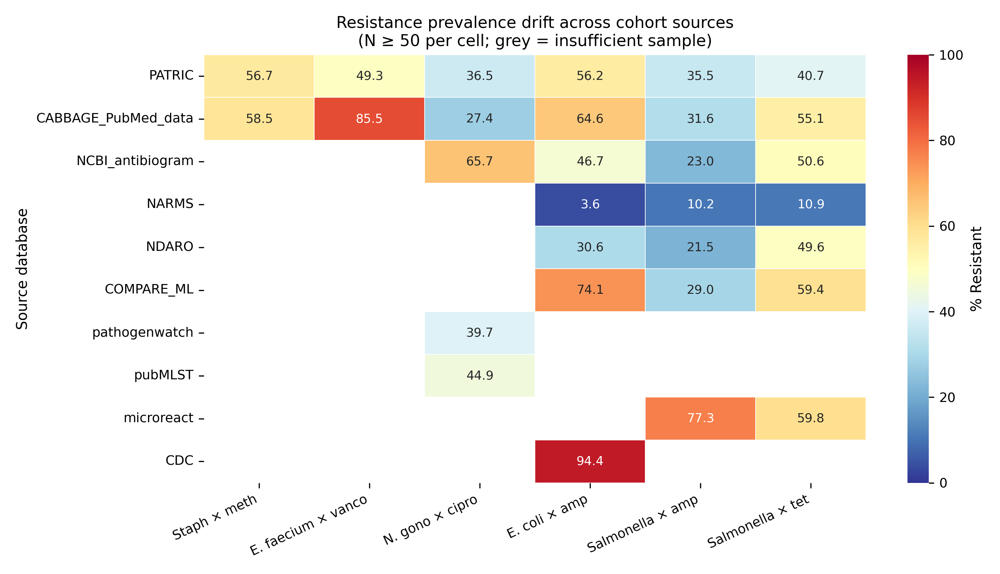

# Beyond the AUROC: what machine learning reveals about antimicrobial resistance

<p align="center">
  <a href="paper/paper.pdf"><strong>📄 Read the Paper (PDF)</strong></a>
  &nbsp;·&nbsp;
  <a href="paper/primer.pdf"><strong>📖 Clinical companion (PDF)</strong></a>
  &nbsp;·&nbsp;
  <a href="paper_es/paper_es.pdf"><strong>🇪🇸 Paper (ES)</strong></a>
  &nbsp;·&nbsp;
  <a href="paper_es/primer_es.pdf"><strong>🇪🇸 Complemento clínico (ES)</strong></a>
</p>

<p align="center">
  
</p>
<p align="center">
  <em>Resistance prevalence (% R) per source × pathogen-drug combination. <em>E. coli</em> × ampicillin ranges from 3.6 % (NARMS, food-chain) to 94 % (CDC, outbreak) — cohort identity predicts most of the resistance rate before any gene is considered.</em>
</p>

---

## Overview

This repository contains the code, figures, and manuscript for a cross-cohort machine-learning study of antimicrobial-resistance (AMR) prediction from bacterial genome assemblies. Using the CABBAGE December 2025 release — 170 000 public bacterial genomes curated by EMBL-EBI — we train ElasticNet and LightGBM classifiers on six WHO-priority pathogen-drug combinations and evaluate on a completely held-out independent cohort.

This study is not primarily a benchmark of algorithms; it is a documentation of three generalisable patterns that emerge once an honest cross-cohort evaluation is enforced. A clinical companion, written for clinicians, microbiologists, and other readers whose domain lies outside machine learning, is available in [PRIMER.md](PRIMER.md).

## Results summary

| Pathogen × drug | N train / test | CV AUROC [95 % CI] | Held-out AUROC [95 % CI] | Rule-only AUROC | Notes |
|---|---|---|---|---|---|
| *Staphylococcus aureus* × methicillin | 1 058 / 659 | 0.997 [0.99, 1.00] † | **0.882** [0.83, 0.92] | 0.962 | † within-PATRIC fallback CV |
| *Enterococcus faecium* × vancomycin | 1 887 / 469 | 0.708 [0.61, 0.80] | **0.992** [0.98, 1.00] | 0.691 | Publication-bias signature |
| *Neisseria gonorrhoeae* × ciprofloxacin | 7 502 / 478 | 0.989 [0.98, 1.00] | **0.982** [0.97, 0.99] | 0.986 | ≈SOTA; single SNP dominates |
| *Escherichia coli* × ampicillin | 12 113 / 640 | 0.906 [0.80, 0.98] | **0.891** [0.86, 0.92] | 0.912 | |
| *Salmonella enterica* × ampicillin | 27 497 / 416 | 0.968 [0.94, 0.99] | **0.962** [0.94, 0.98] | 0.895 | ML > rule by +0.07 (plasmid MDR) |
| *Salmonella enterica* × tetracycline | 27 049 / 270 | 0.979 [0.96, 1.00] | **0.980** [0.96, 1.00] | 0.966 | |

Across six combinations, held-out AUROC ranges from **0.882 to 0.992** with tight bootstrap confidence intervals. Four of six show cross-validation in agreement with held-out test within 0.02 AUROC; two reveal cohort-dependent asymmetries of clinical interest.

## Three findings, ten patterns

The study is organised around three biological-scale findings and ten methodological patterns that are falsifiable in other clinical-prediction domains.

**Finding 1 — Cohort identity encodes the label.** For the same species × drug combination, resistance prevalence differs by up to 91 percentage points across source cohorts. *E. coli* × ampicillin: 3.6 % in NARMS (food-chain surveillance) versus 94 % in CDC (outbreak tracking).

**Finding 2 — Resistance is nearly monogenic.** A single SNP (`gyrA_S91F`) accounts for 42 percentage points of the *N. gonorrhoeae* × ciprofloxacin AUROC. A one- to four-gene rule is within 0.05 AUROC of a 402-feature ElasticNet in four of six combinations.

**Finding 3 — Clinical labels drift.** Applying 2025 EUCAST breakpoints to historical MIC data flips the resistant/susceptible call for 1.8 % of CABBAGE records (31 306 samples) versus the original annotation. The bacteria did not change; the definition did.

See [PAPER.md](PAPER.md) §6 for the ten generalisable patterns distilled from these findings.

## Reproducibility

Downloads the CABBAGE 2025-12 release (no DUA), builds the filtered phenotype table + feature matrix, trains models, evaluates on the reserved held-out cohort, and regenerates all five paper figures.

```bash
git clone https://github.com/maher-coder/amr-benchmark
cd amr-benchmark
pip install -r requirements.txt

python src/fetch_data.py           # downloads CABBAGE (~171 MB) to data/
python src/prepare.py              # applies filters, builds feature_matrix.npz
python src/train.py                # CV + held-out evaluation
python src/make_figures.py         # regenerates figures/
```

Total compute: ~2 hours on a 4-core laptop. No GPU required.

## Repository layout

```
amr-benchmark/
├── PAPER.md  PAPER_es.md          ← formal technical manuscript (EN / ES)
├── PRIMER.md  PRIMER_es.md        ← clinical companion (EN / ES)
├── paper/       ← LaTeX source + compiled PDFs
├── paper_es/
├── src/         ← reproducible scripts
├── data/        ← download instructions (data not committed)
├── figures/     ← 5 publication-quality PNG figures
├── results/     ← cross-validation + held-out metric tables (CSV)
├── references/  ← key papers (BibTeX)
├── CITATION.cff
├── LICENSE-code (MIT)
└── LICENSE-content (CC BY 4.0)
```

## Data and code licensing

Two licences apply:

- **Source code** (`src/` and `*.py`) — [MIT License](LICENSE-code). Permissive, allows commercial reuse, requires attribution.
- **Manuscript content, figures, tables** (`PAPER.md`, `PRIMER.md`, figures, results tables) — [CC BY 4.0](LICENSE-content). Permissive for any use including commercial, requires attribution.

The underlying CABBAGE data is distributed by EMBL-EBI under its own open licence; we do not redistribute the raw data.

## How to cite

Machine-readable citation metadata is in [`CITATION.cff`](CITATION.cff). GitHub auto-renders a "Cite this repository" button from that file.

BibTeX:

```bibtex
@software{elouahabi2026amr,
  author       = {El Ouahabi, Maher},
  title        = {Beyond the AUROC: cohort bias, canonical-gene dominance, and clinical-label drift in machine-learning prediction of antimicrobial resistance},
  year         = {2026},
  month        = apr,
  url          = {https://github.com/maher-coder/amr-benchmark},
  note         = {Version 1.0.0}
}
```

## Related work

- [maher-coder/epigenetic-clock](https://github.com/maher-coder/epigenetic-clock) — earlier project on epigenetic age prediction from public DNA methylation data. Shares the Leave-One-Cohort-Out evaluation design.

## Contact

Maher el Ouahabi · `maher.elouk2@gmail.com`

Questions, corrections, and dataset extensions are welcome via GitHub issues.

---

*All code and text is offered without warranty, and all numeric claims are tied to code that the reader can execute end-to-end.*
